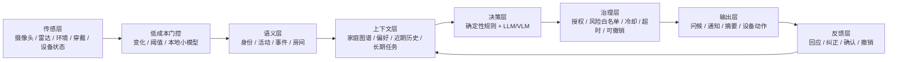

# 2026-08-02 全屋智能、多模态交互与主动智能实现现状

- 调研日期：2026-08-02
- 调研目的：判断行业当前真正落地了哪些“全屋智能 / 多模态交互 / 主动智能”能力，并校正 Reme 的竞品定位与后续验证重点
- 信息口径：优先官方产品页、官方开发文档、官方开源仓库；“已实现”与“已规模化验证”分开判断
- 结论置信度：截至调研日的一手公开资料；不同地区、订阅、设备型号和灰度资格会改变实际可用性

## 1. 执行摘要

1. **全屋连接与规则联动已经成熟，跨设备语义和跨品牌一致性仍在补课。** 米家、华为鸿蒙智家、SmartThings、Google Home、Alexa、Home Assistant 都已经能把设备、房间、传感器和自动化放在同一控制平面；Matter 1.6 开始标准化“带上下文的建议”，但标准发布不等于终端已经普遍支持。
2. **多模态已进入产品，但要区分三件事：多入口、多模态理解、跨模态闭环。** 语音 + 文字 + 屏幕早已普及；摄像头事件描述、视频历史问答、音视频联合感知也已上线或进入早期访问；真正把音视频、身份、长期记忆、设备状态融合后自动行动的公开实现仍很少，小米 Miloco 2.0 是目前最完整、最直接的一例。
3. **“主动智能”不是单一能力，而是五级阶梯。** 当前量产主流集中在事件告警、个性化摘要、习惯建议和经用户同意的自动化；可长期运行、自己拆任务、持续观察并自主执行的 Agent 主要仍是开源参考实现或有限场景，不是已经充分验证的通用家庭管家。
4. **安全场景仍以确定性逻辑兜底。** 华为的康养链路是毫米波检测、恢复等待、分级告警、语音询问和家属通知；Samsung 依靠活动/设备使用异常和机器人巡查；这些实现都没有把大模型作为唯一安全判定器。Reme 的“规则先问候、超时确定性升级、迟到模型不可撤销”与行业可靠做法一致。
5. **Reme 不能再用宽泛的“首个全屋主动关怀 / 首个 MiMo 全屋智能 / 首个老人跌倒后主动询问”叙事。** 最接近的直接重叠是 Miloco 2.0，最强的量产隐私康养对照是华为。Reme 更可辩护的方向是：存量普通摄像头的软件适配、家属端默认不可识别呈现、结构化路径与最小视觉路径可见可比较、规则安全边界、以及不确定性与失败状态显式展示。

## 2. 先统一概念

### 2.1 “全屋智能”至少包含四层

| 层 | 解决的问题 | 当前成熟度 |
|---|---|---|
| 连接层 | 设备接入、发现、房间归属、状态同步 | 高；但跨生态仍有能力差异 |
| 自动化层 | if-this-then-that、定时、地理围栏、设备联动 | 高；适合确定性场景 |
| 认知层 | 谁在什么空间、发生了什么、是否偏离习惯 | 中；依赖摄像头、雷达、穿戴和模型质量 |
| 行动治理层 | 什么时候提醒、什么时候自动执行、如何撤销和追责 | 中低；通常依赖授权、白名单、冷却和人工确认 |

### 2.2 “多模态”容易被混用

- **多入口交互**：语音、文字、触屏、App、手势都能下命令。多数平台已经实现。
- **多模态理解**：模型能联合理解音频、视频、文本和设备状态。Google 的摄像头语义、Miloco 的音视频 Omni 流水线属于这一层。
- **跨模态行动闭环**：感知到一个情境后，结合人物、房间、记忆与设备能力，决定是否说话、提醒或执行。Miloco 2.0 已给出公开实现；其他平台多在特定产品功能内完成，而不是开放的通用闭环。

### 2.3 “主动智能”五级成熟度

| 级别 | 定义 | 典型实现 |
|---|---|---|
| P0 被动控制 | 用户明确说/点，系统执行 | 语音开灯、App 控温 |
| P1 事件触发 | 传感器或状态变化自动执行 | 门开灯亮、燃气告警、自动化规则 |
| P2 语义主动 | 系统理解事件并主动通知/总结/询问 | 摄像头事件描述、Home Brief、跌倒后语音询问 |
| P3 个性化主动 | 结合个人习惯和长期记忆建议或调整 | HyperMind 习惯建议、Samsung Care Insight、Miloco 家庭档案 |
| P4 长期自主 | 把模糊目标拆成任务，持续观察、执行和复盘 | Miloco 2.0 家庭任务；尚无充分公开规模化可靠性证据 |

## 3. 代表性系统的实际实现

### 3.1 小米米家 / HyperMind：量产平台侧的“先建议、同意后主动执行”

米家已经具备传统智能场景、人车家跨端信号、智能助手和 HyperMind。2026-03-16 更新的官方隐私政策明确写到，HyperMind 会基于设备操作、传感器、定位、穿戴健康与车辆状态学习习惯，给出单次或重复操作建议，**用户同意后**才主动执行并将周边设备调到习惯状态。这里的关键不是 LLM 自由行动，而是“数据挖掘 / 行为推理 → 建议 → 用户授权 → 自动执行”。[米家隐私政策](https://g.home.mi.com/views/user-terms.html?countryCode=cn&locale=zh-CN&type=userPrivacy&version=2024)

判断：

- 状态：已在米家正式服务边界中，不是概念演示。
- 强项：跨人、车、家、穿戴的数据面广；习惯学习和执行授权机制明确。
- 边界：公开材料没有给出开放、可复现的语义准确率或长期主动决策可靠性基准；能力是否出现还受设备、系统、地区和用户授权影响。

### 3.2 小米 Miloco 2.0：目前最完整的公开“全屋多模态主动 Agent”参考实现

Miloco 2.0 于 2026-06-18 发布，定位为运行在 NUC、树莓派、Mac mini 等家庭本地设备上的开源方案，以米家摄像头的画面和声音为感知入口，以 MiMo / OpenAI 兼容多模态 API 为认知层，以 OpenClaw 插件和 MiOT 控制设备。官方列出的能力包括常识判断、身份识别、家庭记忆、长期家庭任务、主动智能和家庭面板。[Miloco 2.0 官方仓库](https://gitee.com/xiaomi-miloco/xiaomi-miloco)

本轮直接检查了官方仓库 `bcd65ab9e85eb4a1cb088357e2b7ac2b00836cc1`（提交时间 2026-06-18，`release: miloco 2.0`）。公开代码不是只有演示页面，而是完整参考栈：

```text
米家摄像头音视频
  → 4 秒窗口 / 变化门控（帧差 + 音频能量 + VAD）
  → DeepSORT / ReID 身份跟踪
  → MiMo 多模态推理（caption / speech / matched_rules / suggestions）
  → 静态规则直接控设备，动态规则交给 OpenClaw Agent
  → 家庭档案、任务、周期统计、通知和家庭面板
```

代码核查还确认：默认感知模型是 `xiaomi/mimo-v2.5` 云 API，默认送模型约 1 FPS、采集窗口 4 秒；有价值事件会写数据库并保存对应片段；家庭画像同时注入 Agent 和感知提示词；主动巡检只在有正式档案依据时自动做可逆操作，对门锁、燃气等安全设备采取更保守规则。仓库规模约 728 个跟踪文件、169 个后端源码文件、147 个后端测试文件、16 个 Agent Skills 和 126 个 HTTP/WebSocket 路由。以上数字只证明实现面完整，**本轮没有接真实米家摄像头，也没有运行全套测试或验证真实家庭误报/漏报**。

判断：

- 状态：正式开源的可安装参考实现，不等于面向大众的量产服务或经过安全认证的照护产品。
- 强项：音视频感知、身份、记忆、规则、长期任务、Agent 和设备控制都已落到代码；这是 Reme 最接近的直接竞品 / 上位基线。
- 关键边界：虽然控制服务运行在家中，2.0 默认依赖云端 MiMo，多模态窗口会发往模型 API；持续感知会产生调用费用；事件和模型交互也有本地留存；许可证仅允许 Miloco 项目的非商业用途，不能把代码直接拿来开发商业 App/Web 服务。
- 证据缺口：本轮未在仓库中找到覆盖真实家庭、老人跌倒、长期运行误干预率和安全失效的统一公开基准，因此不能把“功能存在”当成“可靠主动管家已经成立”。

### 3.3 华为鸿蒙智家 AI 辅助康养：窄任务、非摄像头、已产品化

华为的 AI 辅助康养传感器使用 4D 毫米波，在卧室和卫生间提供跌倒 / 坠床 / 卧床过久 / 起夜离床过久 / 滞留过久 / 睡眠等辅助检测。疑似跌倒后可等待恢复，未恢复再告警；系统能通过电话、短信和 App 分级通知，搭配 AI 音箱可自动发起语音救助询问并全屋广播。官方明确宣称原始数据无需上传云端、无画面采集，同时也明确说明它是辅助检测设备、非医疗器械、不能保证安全。[产品页](https://consumer.huawei.com/cn/wholehome/ai-wellness-sensor/)、[功能说明](https://consumer.huawei.com/cn/support/content/zh-cn16045384/)

判断：

- 状态：在售解决方案，场景、安装条件、支持房间和告警流程明确。
- 强项：隐私边界比摄像头方案更强；“检测 → 等待恢复 → 语音询问 → 分级告警 → 家属行动”的关怀链已产品化。
- 边界：是固定空间、固定传感器、固定事件的窄域系统；不提供摄像头层面的开放语义理解，也不是通用家庭 Agent。

### 3.4 Samsung SmartThings Family Care：跨设备活动基线与远程巡查已上线

Samsung 在 2026-04 的 SmartThings 更新中扩展了 Family Care：依据家电和移动设备活动给异地家属通知，提供用药 / 就医提醒、首次和最近活动时间、温湿度与空气质量异常、与前一周相比的活动和设备使用显著变化；当长时间未检测到活动时，家属可让带摄像头和双向音频的扫地机器人巡查。[Samsung 官方更新](https://news.samsung.com/global/samsung-elevates-experiences-to-care-for-users-and-their-families-with-smartthings-update)

判断：

- 状态：SmartThings 服务更新，能力随地区、设备和账户条件变化。
- 强项：把手机、家电、环境传感器和移动摄像头组合成“弱信号拼图”，并提供 Care Insight / Now Brief 这类摘要。
- 边界：异常检测多来自活动和设备使用偏离，语义粒度低于持续视频理解；机器人摄像头是家属主动发起的复核，不是通用自主视觉 Agent。

### 3.5 Google Gemini for Home：多轮语音与摄像头语义领先，仍处于早期访问 / 订阅分层

Gemini for Home 已把自然多轮语音、复杂设备控制、摄像头事件描述、每日 Home Brief、自然语言检索视频历史、自然语言创建自动化放在同一产品面。它能把“检测到人 / 包裹”提升为完整事件描述，也能让用户直接问某个历史片段。[官方发布说明](https://blog.google/products-and-platforms/devices/google-nest/gemini-for-home-launch/)

截至 2026-08，Google 帮助中心仍将 Gemini for Home voice、Ask Home 和摄像头能力标为不同国家的 early access；摄像头高级能力需要 Google Home Premium Advanced。[可用性说明](https://support.google.com/googlehome/answer/16613534?hl=en-IN)

判断：

- 状态：真实产品灰度，不是纯概念，但尚未形成全球统一、无条件可用的基础能力。
- 强项：自然语言控制、视频历史语义化、摘要和检索的产品完成度高。
- 边界：主动性主要表现为重要事件通知和每日摘要；自动化仍由用户描述 / 创建。公开 Home APIs 可让开发者接入设备和自动化，但摄像头相关 trait 仍有限制，不能据此推断第三方可以自由获取并理解所有家庭视频。

### 3.6 Amazon Alexa+：通用 Agent 和跨端对话已规模上线，家庭主动性仍以建议 / 通知为主

Alexa+ 已于 2026-02 面向美国全部用户开放，2026-06 在加拿大全面开放。它支持跨 Echo、Fire TV、手机和网页延续上下文，能一次控制多个设备、调用 Ring 摄像头、做个性化提醒，并可通过 “experts” 调用外部服务完成事务；Amazon 公开描述的主动例子包括交通拥堵提前出发、商品降价提醒等。[美国可用性](https://www.aboutamazon.com/news/devices/alexa-plus-available-free-prime-members-us)、[Alexa+ 能力说明](https://www.aboutamazon.com/news/devices/new-alexa-generative-artificial-intelligence)

判断：

- 状态：美国 / 加拿大已普及，其他地区仍有 early access 差异。
- 强项：跨端连续对话、身份个性化、服务执行生态和自然语言控制规模最大的一类。
- 边界：公开例子更多是个人助理主动性和 Ring / 智能家居控制的组合；没有证据表明 Alexa+ 已普遍以连续家庭视频为输入，自主决定并执行高风险家庭动作。开发者侧主动能力仍通过状态上报、通知、设备 capability 和受限接口治理。

### 3.7 Home Assistant：可组合、可本地、主动对话已实现，但主动策略仍由用户编排

Home Assistant 支持本地或云端 LLM、房间感知的语音终端、流式 TTS、图像理解和设备工具调用。自 2025.7 起，Assist 可以由自动化主动发起对话，例如检测到车库门未关后先询问用户是否关闭；用户也能把关键逻辑留在非 AI 自动化里，只让模型负责理解和表达。[官方 AI 架构说明](https://www.home-assistant.io/blog/2025/09/11/ai-in-home-assistant/)

判断：

- 状态：可用的开源平台能力。
- 强项：本地优先、模型可替换、AI 与关键自动化可分离，适合研究和自定义。
- 边界：默认不会自己发现长期照护目标；“主动”通常仍由用户先写 automation / blueprint，再由 LLM 负责对话或非关键推理。

### 3.8 Matter 1.6：连接标准开始承载“建议”，但它不是智能本身

Matter 1.5 已加入摄像头，1.6 于 2026-06 增加 Thermostat Suggestions：生态可以发送有时效的建议，恒温器结合用户偏好和当前环境决定是否采纳，并给出拒绝理由。这个设计很重要——它把“AI 建议”与“设备最终执行”分层，而不是让任意生态直接覆盖用户最近的手动选择。[Matter 1.6 官方说明](https://csa-iot.org/newsroom/matter-1-6-enables-more-intuitive-setup-multi-ecosystem-experiences-and-context-driven-control/)

判断：

- 状态：规范和 SDK 已发布，厂商落地需要各自时间表。
- 意义：Matter 解决设备语义、控制与多生态治理，不负责生成家庭意图；上层认知与安全策略仍属于平台 / Agent。

## 4. 横向结论：哪些已经成立，哪些还没有

| 能力 | 当前判断 | 证据强度 |
|---|---|---|
| 多品牌设备接入、房间和状态模型 | 已成熟 | 多个平台量产，Matter 持续扩类 |
| 传感器触发联动 | 已成熟 | 所有主流平台均支持 |
| 自然语言创建 / 控制自动化 | 已上线 | Google、Alexa、Miloco、Home Assistant |
| 摄像头事件语义描述和历史问答 | 已上线但有订阅 / 地区限制 | Google；Miloco 参考实现 |
| 音视频 + 身份 + 规则联合感知 | 已有公开实现 | Miloco 2.0；真实家庭可靠性仍待独立验证 |
| 行为基线和习惯建议 | 已上线 | HyperMind、Samsung、Miloco |
| 用户未开口时主动询问 | 已上线于窄场景 | 华为康养、Home Assistant 自动化、Reme 当前链路 |
| 根据长期目标持续观察和执行 | 有实现，未充分规模化验证 | Miloco 2.0 任务系统最完整 |
| 让 LLM 独立决定高风险安全动作 | 不应视为已成立 | 主流实现仍保留规则、设备限制或人工确认 |
| 通用、可靠、低打扰、可解释的“家庭自主管家” | 尚未成立 | 缺少跨家庭长期误干预率、恢复机制和安全审计公开证据 |

## 5. 当前最稳定的工程形态



行业里真正稳定的不是“所有事情都交给大模型”，而是：

- 高频感知先用本地门控削减调用；
- 安全事件由窄规则或专用传感器触发；
- 大模型负责开放语义、自然表达和低风险计划；
- 高风险动作需要白名单、延迟确认、设备端拒绝或人类授权；
- 用户纠正必须能改变后续行为，并且可查看、撤销和审计。

## 6. 对 Reme 的直接影响

### 6.1 需要主动放弃的宽泛叙事

- “首个全屋主动智能”——Miloco 2.0 已直接占据该概念。
- “首个用 MiMo 看懂家庭并联动设备”——Miloco 已实现。
- “首个老人跌倒后主动询问 / 通知家属”——华为已有产品化方案，Samsung 也有异地关怀和巡查链路。
- “本地处理就是隐私领先”——Miloco 服务也在本地运行，华为甚至不用摄像头；必须具体说明哪些数据被处理、展示、发送和留存。
- “多模态”作为创新点——语音、视频、屏幕和传感器组合已经普遍，需证明跨模态融合真正改变了决策质量。

### 6.2 更可辩护的 Reme 位置

1. **不是全屋通用管家，而是隐私优先的主动关怀垂直层。** 目标是把一个不确定的照护事件变成可理解、可回应、可升级的闭环。
2. **不是“看得更多”，而是“为解决当前问题只看最少”。** 家属 / 评委端默认骨架或抽象状态；结构化 S 路径与最小视觉 V 路径都可运行，发送内容在界面和审计中可见。
3. **不是让 MiMo 判安全，而是让 MiMo 改善沟通。** 候选事件和超时升级由确定性逻辑控制，MiMo 负责措辞、主诉理解和低风险建议，迟到结果不能撤销告警。
4. **不是声称取代专用毫米波硬件，而是验证存量普通摄像头的软件兼容性和成本路径。** 华为是更强隐私基线，Reme 的价值只能来自更低改造门槛、更丰富互动和明确的数据最小化。
5. **失败可见本身是产品差异。** 低置信、人物不可见、网络不可用、视觉未发送、模型降级和规则升级应显式展示，而不是用流畅动画遮住。

### 6.3 最值得做的对照实验

不建议再做一个通用“家庭记忆 + 全屋任务 + VLM 规则”系统，那会直接进入 Miloco 的主场。Reme 的下一组证据应围绕以下合同：

| 问题 | 推荐对照 | 关键指标 |
|---|---|---|
| 结构化骨架是否足够理解关怀事件 | S：姿态 / 转变 / 上下文；V：增加最小关键帧或短片 | 决策一致率、首次结构校验率、响应时间、视觉发送量 |
| 主动问候是否比直接告警更有用 | 直接家属通知 vs 先问候再超时升级 | 首次问候时间、有效回应率、无谓家属打扰率 |
| 隐私抽象是否仍让家属理解事件 | 原画、强模糊、骨架、纯事件卡 | 家属理解正确率、识别个人的成功率、主观接受度 |
| 模型失效时安全链是否保持 | 正常、超时、非法 JSON、断网、迟到返回 | 升级时序、错误恢复、迟到结果撤销次数（应为 0） |
| 存量摄像头路径是否有现实优势 | Reme 摄像头软件链 vs 专用毫米波功能口径 | 部署步骤、硬件成本、覆盖场景、误报 / 漏报与隐私代价 |

## 7. 基线选择与下一锚点

- **产品流程基线：华为康养。** 它证明“检测 → 恢复等待 → 主动询问 → 分级通知 → 家属处置”不是空白市场；Reme 必须在交互质量、存量兼容和隐私呈现上拿出可测差异。
- **系统架构基线：Miloco 2.0。** 它证明“摄像头音视频 → MiMo → 记忆 / 任务 → 全屋设备”已经有完整公开实现；Reme 不应复制其广度，只应借它检验自己的边界是否足够清晰。
- **开放工程基线：Home Assistant。** 它提供“自动化负责触发，LLM 负责自然对话，关键动作可不交 AI”的可组合安全模式。
- **协议治理参考：Matter 1.6 Suggestions。** AI 输出优先表达为有时效、可拒绝、可解释的建议，而不是无条件设备命令。

下一锚点应是一次窄评审：用同一组跌倒 / 长时间静止 / 普通活动样例，对 Reme 的 S/V 双路径、确定性升级和隐私呈现做可重复测量；通过后再决定是否把“全屋上下文 / 长期记忆”从休眠能力抬入产品故事。

## 8. 本轮没有证明的事项

- 没有对任何厂商的宣传准确率做第三方复现。
- 没有证明 Miloco 2.0 可在 Reme 当前机器、真实米家摄像头或真实老人家庭中稳定长期运行。
- 没有证明 Google、Alexa 或 Samsung 的全部能力在中国大陆可用。
- 没有证明 Matter 1.6 的建议机制已经被主流终端普遍采用。
- 没有给 Reme 推导新的准确率、延迟、误报率或医疗效果承诺。

## 9. 主要一手来源

- [米家隐私政策：智能场景、HyperMind、人车家自动化](https://g.home.mi.com/views/user-terms.html?countryCode=cn&locale=zh-CN&type=userPrivacy&version=2024)
- [Xiaomi Miloco 2.0 官方仓库](https://gitee.com/xiaomi-miloco/xiaomi-miloco)
- [华为全屋智能 AI 辅助康养传感器](https://consumer.huawei.com/cn/wholehome/ai-wellness-sensor/)
- [Samsung SmartThings Family Care 2026 更新](https://news.samsung.com/global/samsung-elevates-experiences-to-care-for-users-and-their-families-with-smartthings-update)
- [Google Gemini for Home 产品发布](https://blog.google/products-and-platforms/devices/google-nest/gemini-for-home-launch/)
- [Google Gemini for Home 可用性](https://support.google.com/googlehome/answer/16613534?hl=en-IN)
- [Amazon Alexa+ 全美开放](https://www.aboutamazon.com/news/devices/alexa-plus-available-free-prime-members-us)
- [Home Assistant 本地 AI 家庭架构](https://www.home-assistant.io/blog/2025/09/11/ai-in-home-assistant/)
- [Matter 1.6 上下文建议与多生态控制](https://csa-iot.org/newsroom/matter-1-6-enables-more-intuitive-setup-multi-ecosystem-experiences-and-context-driven-control/)
