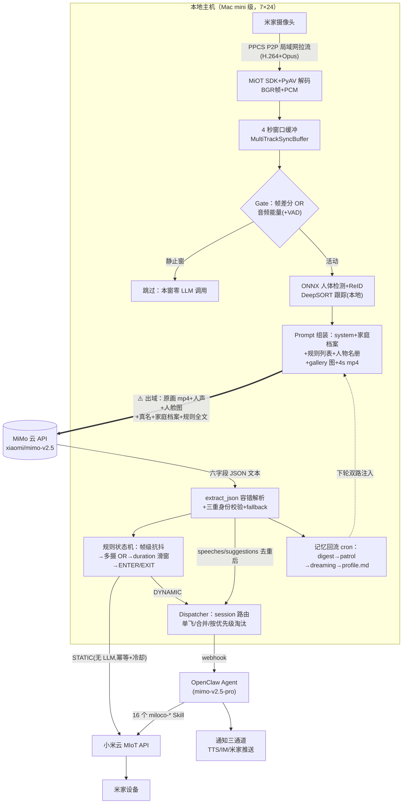

# 情报：Miloco 代码剖析（MiMo 使用方案 · 数据结构 · 流转图）

> 调查时间：2026-08-01。对象：[XiaoMi/xiaomi-miloco](https://github.com/XiaoMi/xiaomi-miloco)（GitHub main @ 1495fac，3168 stars）+ [gitee 镜像](https://gitee.com/xiaomi-miloco)（滞后约 6 周，停在 v2026.6.18）+ [xiaomi-mimo-vl-miloco](https://github.com/XiaoMi/xiaomi-mimo-vl-miloco)（本地模型仓库）。方法：完整 clone 逐文件读码，行号以 GitHub main 为准。
> 定位关系与答辩话术见 [情报-Miloco.md](情报-Miloco.md)；本文回答**代码层面它怎么用 MiMo**——供 MIMO-01~04 对照、供隐私对比取证。许可红线：代码/权重**非商用且禁止用于开发软件**，本文只作参考取证，Reme 零复用。

## 1. 结论速览

1. Miloco 2.0 不是独立 App，是 **OpenClaw（小米 AI Agent 运行时）的插件**：Python FastAPI 后端（感知/规则/MIoT）+ TS 插件 + React 面板 + CLI，跑在家庭本地主机（推荐 Mac mini，≥4GB 内存，无 GPU）。
2. MiMo 调用是**自封装 httpx，不用 openai SDK**：默认模型串 `xiaomi/mimo-v2.5` @ `https://api.xiaomimimo.com/v1`，OpenAI 兼容 `/chat/completions` + Bearer 头；Provider 适配器层可换 Qwen3.5-Omni、Gemini 或任意自建 OpenAI 兼容端点（Ollama/vLLM）。
3. **视频以整段 mp4 入 prompt**（非逐帧图片）：4 秒窗口、短边 512、h264+AAC、base64 进 `video_url` 块，`fps:1`，并显式 `thinking: {"type":"disabled"}`。
4. **输出是纯 prompt 约定的六字段 JSON**（identities/caption/speeches/env_sounds/matched_rules/suggestions）——无 function calling、无 response_format，靠 `extract_json` 容错解析 + 失败 fallback。
5. **成本控制是架构主轴**：Gate（帧差分+音频能量）静止窗零调用、音频-only 降级路由、字段级裁剪防幻觉（无人声即删 speeches 字段）、三态熔断器、token 用量入库可视化。README 直接警告"持续产生 API 调用费用"。
6. 本地 ONNX 只做辅助（人体检测/ReID/VAD/句向量），**语义理解全部依赖云端 VLM**；本地化 = 把 base_url 指向自建 Ollama/vLLM（代码注释明示支持，但无官方端到端指引）。
7. **1.x → 2.0 是路线反转**：v0.1.x（2025-11）Docker + NVIDIA GPU + 魔改 llama.cpp 本地跑 MiMo-VL-Miloco-7B GGUF 的"隐私优先"方案；2.0（2026-06）重构为云 API 优先，隐私叙事让位能力叙事。
8. **隐私出域清单明确**：每触发窗口的 4 秒原画 mp4（含人声）、家庭成员人脸/全身参考图、成员真名、家庭档案（作息/健康状况）、规则全文随 prompt 出域；设备控制固定走小米云。
9. **老人关怀是其官方点名场景**（跌倒预警、久坐提醒、记录起夜）——与 Reme 正面重叠，答辩必被问。
10. 许可：主仓库与模型仓库（含权重）同为专有非商用许可，明文禁止"开发 APP、Web 服务及其他形式的软件"，禁用"小米/米家"字样宣传 ⇒ **MiMo-VL-Miloco-7B 权重也不可直接采用**。

## 2. 架构与部署形态

- **形态**：OpenClaw ≥2026.5.2 的 Agent 插件（`README.zh.md:14,42`）；不依赖 Home Assistant；依赖小米账号 OAuth + 米家摄像头（同局域网，PPCS P2P 拉流）。
- **部署**：`install.sh` 一键装，uv workspace，后端单进程 FastAPI 监听 `127.0.0.1:1810`，React 面板由后端直接伺服；macOS/Linux（Windows 走 WSL），7×24 常驻。
- **后端五层**：Router → Service/Runner → Repo(SQLite) → 外部代理；域模块 `miot/ perception/ rule/ person/ task/ home_profile/ dispatch/ observability/` 等。
- **通信全景**：摄像头→后端走 MiOT SDK 闭源 C 库 P2P；后端→米家设备**固定走小米云 HTTP**（LAN 仅发现）；后端→OpenClaw 走 webhook（Bearer）；前端走 REST+SSE。
- **1.x vs 2.0**：

| | 1.x（v0.1.x，2025-11） | 2.0（v2026.6.18 起） |
|---|---|---|
| 形态 | 独立 Docker Compose 三服务 | OpenClaw 插件 + 本地 FastAPI |
| 硬件 | NVIDIA 30 系 8GB+ 显存 | 无 GPU，Mac mini 级 |
| 推理 | 本地 llama.cpp 魔改引擎跑 `MiMo-VL-Miloco-7B_Q4_0.gguf` | 云端 mimo-v2.5 API |
| 规则判定 | 每规则一次 VLM 调用（`{"result":"yes"/"no"}`） | 单次调用批判全部规则+常识+身份+转录（六字段合一） |

## 3. MiMo 调用代码方案（MIMO-01~04 对照重点）

代码路径前缀 `backend/miloco/src/miloco/perception/engine/omni/`。

### 3.1 客户端与配置

```yaml
# settings.yaml:22-28（运行时 $MILOCO_HOME/config.json，env MILOCO_MODEL__OMNI__API_KEY 兜底）
model:
  omni:
    label: "mimo"
    model: "xiaomi/mimo-v2.5"
    base_url: "https://api.xiaomimimo.com/v1"
    api_key: ""
```

- 自封装 httpx（`omni_client.py`），URL 拼 `{base_url}/chat/completions`，`Authorization: Bearer` + `User-Agent: xiaomi-miloco/2.0.0`（`provider.py:98-102`，`constants.py:6`）。
- ⚠️ 模型名与官方平台文档（`mimo-v2.5`，见 [情报-MiMo-API](情报-MiMo-API.md) §3）差一个 `xiaomi/` 前缀——MIMO-01 最小调用先按官方 `mimo-v2.5`，404 再试 Miloco 写法。
- Agent 侧模型（mimo-v2.5-pro）配在 OpenClaw 里，不在本仓库（`README.zh.md:44`）。
- Provider 适配器按模型名子串路由（`provider.py:468-481`）：`MiMoAdapter` 出 `video_url`/`input_audio` 块并带 `thinking:{"type":"disabled"}`；Gemini 走原生 `generateContent`；响应统一反解析回 OpenAI 形态，下游解析器与 provider 无关。

### 3.2 输入编码

- 每 4 秒窗口的 BGR 帧+PCM 用 PyAV 编成 h264/AAC mp4（短边 512），base64 放进 `{"type":"video_url","video_url":{"url":"data:video/mp4;base64,..."},"fps":1,"media_resolution":"max"}`（`prompt_builder.py:1204-1299`）。纯音频窗口编 m4a 走 `input_audio` 块。
- 家庭成员参考图：每人全身+人脸 PNG composite（高 256px，上限 10 人）以 `image_url` data URI 附加；任一成员合成失败整段放弃（"全或无"防错认）。

### 3.3 Prompt 结构（fused 单调用）

```
system → [家庭档案 user] → [# 待判断规则 user] → [只读历史 user] → 主 user(多模态)
```

- system 按场景（video/audio × 有无身份候选 × 有无人声）动态装配：`角色 → 输出模式 → 总原则 → 任务 → 输出格式(JSON schema 字面量) → 字段说明 → 通用常识 → 输出实例`（`prompt_builder.py:406-459`）。
- 总原则核心："**宁缺毋滥**——看不清/听不清/拿不准一律不输出"，附大段防幻觉护栏（不从 gallery/档案凭空点名、音频不作规则命中依据、只报画面直接可见事实）（`constants.py:16-23`）。
- 规则以自然语言逐条列入 `# 待判断规则`，模型照抄规则名，解析层 name→UUID 还原。
- 主 user：当前时间 → 位置 → 已识别/待识别人物名册（bbox 归一化 [0,1000]）→ gallery 图 → 主视频块。

### 3.4 输出与解析（与我们 MIMO-04 同题异解）

- 六字段 schema 字面量集中于 `field_registry.py`（单一来源，按场景裁剪字段——**裁剪即防幻觉**：audio 路由剥 caption/identities，VAD 无人声剥 speeches）：

```
identities:[{track_id,name,confidence,reason}] / caption(≤100字) / speeches:[{speaker,content,is_complete,needs_response}]
env_sounds / matched_rules:[{rule_name,reason,hit}] / suggestions:[{event,action,urgency:high|medium|low}]
```

- 解析：`extract_json`（剥 markdown 围栏）→ `json.loads` → Pydantic；失败返回 skipped fallback；identities 三重校验（track_id 必须在 prompt 列表内、unknown 规范化、confidence<0.5 强制 unknown）（`response_parser.py`）。
- **错误处理**：超时 30s；**无请求级重试**——失败抛 OmniError 靠下一感知周期自然重试；配三态**熔断器**（OPEN 直接短路省钱，HALF_OPEN 两阶段探测恢复）+ 错误分类器；配置三元组变更热生效并重置熔断。
- **用量记账**：每次调用 usage（含 cached/audio/video_tokens）落 SQLite，面板可视化。

### 3.5 云端/本地双路径

- 2.0 仓库内**无本地推理运行时**；本地化 = base_url 指向自建 Ollama/vLLM（`probe.py:25-27` 注释明示，故意不封内网 IP）。
- 本地模型在 [xiaomi-mimo-vl-miloco](https://github.com/XiaoMi/xiaomi-mimo-vl-miloco)：MiMo-VL-7B 底座 SFT+GRPO 家庭场景特化，HF 有 GGUF 量化，`/no_think` 关思考（技术报告 arXiv 2512.17436）。
- 现实摩擦：Ollama 原生不支持其 `video_url`/`input_audio` 块，社区靠代理（FFmpeg 抽帧+whisper 转写改写请求）补缺——本地路径并非开箱即用。

## 4. 数据结构清单（链路每一跳）

| # | 跳 | 结构 | 出处 |
|---|---|---|---|
| 1 | 帧/音频 | `VideoFrame`(BGR ndarray)+`AudioFrame`(s16 PCM)→`MultiTrackSyncBuffer` 窗口对齐 | `perception/types.py:31-47` |
| 2 | Gate 产物 | `GatePacket{visual_active,audio_active,speech_active,hold}`；静止窗 None 整链跳过 | `engine/types.py:30-56` |
| 3 | 身份产物 | `IdentityPacket{frames,audio_clip,targets:[{track_id,person_id,bbox_xyxy_norm}]}` | `engine/types.py:143-243` |
| 4 | 推理请求 | OpenAI messages（§3.3）；含 `media_info{video_width,fps,frame_count,...}` | `provider.py:33-43` |
| 5 | 推理响应 | OpenAI 形态，`usage.prompt_tokens_details{cached_tokens,audio_tokens,video_tokens}` | `omni_client.py:383-392` |
| 6 | 感知结果 | `RealtimePerceptionResult{caption,matched_rules,speeches,env_sounds,suggestions,skipped,timing,usage}`；room/device 字段由 engine 回填（模型不产） | `perception/types.py:240-366` |
| 7 | 规则对象 | `Rule{mode:event\|state, lifecycle:permanent\|temporary, condition.query(自然语言), actions/desc 互斥→STATIC/DYNAMIC, duration_seconds, duration_ratio, exit_debounce}` | `rule/schema.py:33-120` |
| 8 | 事件文本 | 竖排 key:value，头部 `[感知引擎]事件提醒：/语音提醒：/规则提醒：` | `perception/event_text_builder.py:30-94` |
| 9 | Webhook 体 | `{"action":"agent","payload":{message,sessionKey:"agent:main:miloco[-rule\|-suggest]",lane,traceId,idempotencyKey,timeoutMs:180000}}` | `utils/agent_client.py:23-120` |
| 10 | 设备指令 | `MIoTSetPropertyParam{did,siid,piid,value}` → 小米云 HTTP | `rule/runner.py:1169-1244` |
| 11 | 落盘事件 | `meaningful_events` 表 + `snapshots/{event}/`（clip.mp4+调用 trace），TTL+LRU 清理 | `perception/snapshot_context.py` |

## 5. 数据流转全链路



逐步链路（可对照上图）：

1. 常驻拉流（**窗口节拍驱动**，非摄像头移动侦测回调）→ 2. `PerceptionRunner` 双触发调度，单线程推理池 → 3. 房间/设备两级 asyncio 并发编排 → 4. Gate 过滤（90s hold 滞回）→ 5. 本地跟踪出 track+gallery → 6. fused 单调用云端 MiMo（熔断器前置）→ 7. 解析回填 + 规则 True/False 上报 + speeches/suggestions 语义去重（bge 句向量）交投递 → 8. 规则状态机 → 9. STATIC 直控设备 / DYNAMIC 走 Agent → 10. Dispatcher 队列 webhook → 11. OpenClaw Agent（mimo-v2.5-pro）用 Skill 控设备/通知/管任务，上下文溢出删会话重试自愈 → 12. caption 经三级 cron（digest/patrol/dreaming）沉淀进 `profile.md`，下轮感知与 Agent 双路注入——**感知→记忆→感知闭环**。

## 6. 全屋智能场景案例（官方点名，全部自然语言配置，无 YAML）

| 场景 | 配置方式 | 出处 |
|---|---|---|
| 老人跌倒/孩子玩刀具分级预警 | **零配置**，内建"通用常识"suggestions 自动巡检（判据含呕吐/抽搐/跌倒/晕厥/灶台干烧/玻璃破碎） | README 核心特性首条；`constants.py:79-83` |
| "爷爷在书房坐超 30 分钟提醒活动" | 对 Agent 说一句话 → DYNAMIC duration 规则 | `perception-pipeline.md:27` |
| "老人长时间未移动"主动建议 | 零配置 suggestions | `perception-pipeline.md:19` |
| 陌生人在家告警 | DYNAMIC 规则 | `perception-pipeline.md:29` |
| "有人在书房开台灯，人走关灯" | STATIC state 规则（执行无 LLM） | `rule-automation.md:31` |
| "孩子哭了自动处理"（白天通知/深夜放音乐） | DYNAMIC event 规则，Agent 自主决策 | `rule-automation.md:33` |
| "等快递到了通知我" | temporary 规则，事后自删 | `rule-automation.md:35` |
| 每天 8 杯水打卡 / 练琴限时 / **记录老人每次起夜** | 任务系统 progress/duration/event 三型 | `task-management.md:26-30` |
| "记住爸爸不喜欢灯太亮" | 家庭记忆直写 profile.md | `user_guide_zh.md:41-45` |

注意：老人跌倒、久坐、起夜三个场景与 Reme 正面重叠——答辩必被问"Miloco 已经能做，Reme 还做什么"，回答口径见 [情报-Miloco.md](情报-Miloco.md) §2.2（差异不在场景清单，在数据边界）。

## 7. 隐私边界（对比取证，答辩弹药）

**默认云端配置下，每个触发窗口出域**（发往 `api.xiaomimimo.com`）：① 4 秒原始画面+人声 mp4；② 家庭成员人脸+全身参考图（生物特征样本随每次身份识别反复出域）；③ 成员真名名册+坐标；④ 家庭档案 profile.md（作息、健康状况如"爸爸有高血压"）；⑤ 规则全文/房间名/时间。另：设备控制指令固定走小米云；Agent 会话走云端 mimo-v2.5-pro。

**留在本地**：原始码流仅局域网 P2P；四个辅助 ONNX 模型；人脸样本库、SQLite、事件 clip（TTL 清理）、profile.md。

**关键叙事事实**：Miloco 1.x README 自己写"On-Device LLM…ensure family privacy"，2.0 改为"感知与 Agent 主要依赖云端大模型"——**官方路线从本地隐私优先反转为云端能力优先**。Reme 的"看得更少"（只出去身份化事件 JSON，见 [方案-MiMo接入](../integration/方案-MiMo接入.md) §4.1）是与 Miloco 2.0 实际数据流的差异，不是与其宣传口径抬杠。对照表：

| | Miloco 2.0（实测代码） | Reme（v3.0 冻结） |
|---|---|---|
| 出网载荷 | 原画 mp4+人声+人脸图+真名+健康档案 | 去身份化事件 JSON（无图像无关键点） |
| 语义理解位置 | 云端 VLM（mimo-v2.5 看画面） | 端侧规则出事件，云端 MiMo 只做认知决策 |
| 高风险兜底 | Agent 自主决策 | 确定性状态机 > MiMo（不可被覆盖） |
| 部署 | Mac mini 7×24 + 米家摄像头 + OpenClaw | 浏览器打开即用 |

## 8. 可借鉴的工程模式（学思路，零代码复用）

1. **prompt 约定 JSON + 容错解析 + fallback**：官方在同一个 API 上也没用 function calling / strict schema——佐证我们 MIMO-04"JSON mode+校验+降级"是正解而非妥协。
2. **字段级裁剪防幻觉**：没证据的字段直接从 schema 删掉不让模型填——MIMO-03 prompt 可借鉴（如无对话历史就不给 dialogue 相关字段）。
3. **"宁缺毋滥"总原则 + 输出实例**：其 system prompt 结构（角色→原则→任务→schema 字面量→字段说明→实例）是现成的 MIMO-03 模板范式。
4. **熔断器 + 错误分类**：48h 版可简化为"连续 N 次失败自动切 mock + 面板提示"，即 SAFE-01 降级的工程化表达。
5. **usage 记账进日志**：latency+token 落 AuditEntry（MIMO-12 已规划，坚持做）。
6. **Gate 思想**：我们的对应物是"规则引擎先筛事件，MiMo 只看事件"——天然比 Miloco 每 4 秒窗口调 VLM 省一个数量级成本，可作为答辩的成本论据。
7. **thinking 显式关闭**：官方感知调用就是 `thinking: disabled`——我们决策调用同样照做（已入 [方案-MiMo接入](../integration/方案-MiMo接入.md) §5）。

## 9. 未确认事项

1. MiMo API 平台侧数据留存/训练使用政策未深读（用户协议已缓存，见 情报-MiMo-API §8 的补充线索）。
2. OpenClaw 本体闭源未审；Agent 侧 mimo-v2.5-pro 调用实现未见源码。
3. gitee 镜像滞后 GitHub main 约 6 周（缺 Hermes 兼容层、事件反馈打包等 7 月代码）；结论以 GitHub main 为准。
4. `xiaomi/mimo-v2.5` 前缀写法与官方平台模型名的关系未实测（G-01 顺带验证）。
