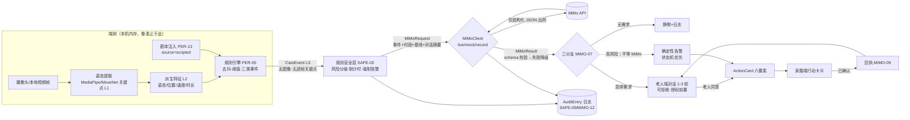
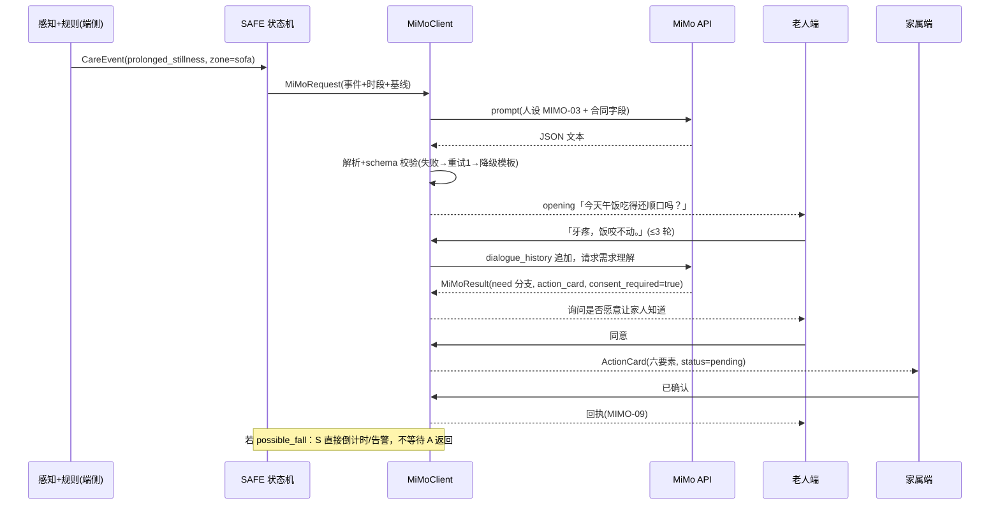

# 方案：Reme 的 MiMo 代码使用方案（数据结构与流转）

> 状态：草案（2026-08-01，配合 0-4h 冻结会使用）
> 依据：[核心产品文档 v3.0](Reme-核心产品文档-v3.0.md) §04 MiMo 固定输入/输出合同、[任务分解](任务分解.md) MIMO-01~16 与三份数据契约、[情报-MiMo-API](情报-MiMo-API.md)、[情报-Miloco-代码剖析](情报-Miloco-代码剖析.md)。
> 本文回答一个问题：**代码层面怎么用 MiMo**——客户端结构、每一跳的数据结构、完整流转图。API 端点等外部事实以情报文档为准，此处只引用不复述。

## 1. 总体原则（v3.0 冻结口径）

1. MiMo 只接收**结构化事件与必要对话文本**，永不接收原始视频帧（验收项：原始视频不进入任何网络请求）。
2. 高风险规则状态机 **>** MiMo 输出：MiMo 可生成解释与文案，不能取消确定性告警，不能输出医疗诊断。
3. 所有 MiMo 输出先做 schema 校验：解析失败重试 1 次 → 降级规则模板，`degraded` 落日志。
4. MiMoClient 同时支持 **live / mock / record** 三模式，现场断网不影响产品闭环（live 视为加分而非前提）。

## 2. MiMoClient 结构（MIMO-02）

```
MiMoClient（统一入口，模式可运行时切换）
├── live   → HTTP 调 MiMo API（形态见 情报-MiMo-API.md；含超时/重试/降级）
├── mock   → 剧本 JSON 资产（MIMO-10，三分支预置对话，与 live 同构响应）
└── record → 录制的真实会话回放（MIMO-11，P2）
```

调用侧只见一个接口：`decide(request: MiMoRequest) -> MiMoResult`。三模式返回同一结构，下游（分流器/UI/日志）不感知模式差异；这也是"注入事件与真实事件同 schema 同通路"原则在认知层的延伸。

内部管线（live 模式）：

```
MiMoRequest → prompt 拼装(MIMO-03 人设) → HTTP 调用(超时上限) → 文本抽取
  → JSON 解析 + schema 校验(MIMO-04) →(失败)→ 重试 1 次 →(再失败)→ 规则模板降级(degraded=true)
  → MiMoResult + AuditEntry(MIMO-12/SAFE-09)
```

## 3. 数据结构（每一跳的载荷）

以下为 v3.0 合同的 JSON 化，供 0-4h 冻结会直接采用/修订。字段名以合同为准，示例值仅示意。

### 3.1 事件输入 `CareEvent`（感知层 → 规则层 → MiMo）

```json
{
  "schema_version": "1.0",
  "event_type": "prolonged_stillness",
  "ts": "2026-08-01T02:00:00+08:00",
  "duration": 1800,
  "zone": "sofa",
  "pose_state": "sitting",
  "motion_level": "low",
  "confidence": 0.82,
  "severity": "normal",
  "description": "客厅沙发静坐超过 30 分钟",
  "source": "live"
}
```

- `event_type ∈ {normal, prolonged_stillness, possible_fall}`（v3.0 三类）；`source ∈ {live, scripted}`，注入与真实同构。
- 不含图像、不含逐帧关键点（关键点属 L1/L2，止于端内；下游只依赖 L3 事件层）。
- 现状缺口：`src/reme/contracts.py` 的 `EventCandidate` 缺 `zone/pose_state/motion_level`，`EventType` 缺 normal 类，命名 `duration_ms` vs 合同 `duration`——待冻结会对齐（该 spike 按 CONTEXT.md 属未接受探索，不直接扩展）。

### 3.2 认知输入 `MiMoRequest`（规则层 → MiMoClient）

```json
{
  "event": { "…": "CareEvent 全量" },
  "time_context": { "local_time": "02:00", "period": "night" },
  "baseline_summary": "近一周 22:30 前入睡；白天沙发静坐通常不超过 40 分钟",
  "recent_events": [ { "event_type": "normal", "ts": "…" } ],
  "dialogue_history": [ { "role": "assistant", "text": "…" }, { "role": "elder", "text": "…" } ]
}
```

### 3.3 决策输出 `MiMoResult`（MiMoClient → 分流器/双端 UI）

```json
{
  "risk_level": "normal",
  "need_dialogue": true,
  "dialogue_goal": "确认长时间静坐原因，留意饮食情况",
  "opening": "今天午饭吃得还顺口吗？",
  "family_notification": "none",
  "reason_summary": "夜间长时间静止，与基线不符，但无跌倒特征",
  "action_card": null,
  "consent_required": true,
  "fallback_action": "20 分钟后无响应则再次轻量确认"
}
```

- 前五个字段为决策输出、后四个为行动输出（v3.0 合同两行的合并载荷）。
- 校验失败重试 1 次后降级：由规则模板按 `event_type × time_context` 生成保守 `MiMoResult`，`degraded=true` 落日志。
- 分支判定（MIMO-07）：无需求 / 具体需求 / 高风险。高风险分支不等待 MiMo——SAFE 状态机直接推进倒计时与强制告警，MiMo 仅补充解释文案。

### 3.4 行动卡片 `ActionCard`（MIMO-08 → 家属端，六要素全必填）

```json
{
  "event": "长时间静坐 + 主诉牙疼",
  "elder_quote": "牙疼，饭咬不动。",
  "system_judgment": "疑似口腔问题影响进食，非紧急",
  "suggested_action": "本周内预约口腔科检查",
  "time_window": "3 天内",
  "status": "pending"
}
```

- `consent_required` 授权前置：普通需求先征得老人同意再通知家属；缺任一要素即校验拦截。
- `status ∈ {pending, confirmed, done}`；家属"已确认" → MIMO-09 回执编排 → 老人端提示。

### 3.5 审计日志 `AuditEntry`（SAFE-09 / MIMO-12 合并单内核）

```json
{
  "ts": "2026-08-01T02:00:05+08:00",
  "mode": "live",
  "event_summary": "prolonged_stillness@sofa 30min",
  "latency_ms": 1240,
  "branch": "need",
  "reason": "夜间静坐超基线",
  "degraded": false,
  "consent_action": "granted",
  "source": "live"
}
```

append-only、刷新不丢、一键导出 JSON/CSV；文件头含实测口径声明（不预承诺 500ms）。

## 4. 数据流转图

### 4.1 端到端数据流（一图看全隐私边界）



隐私红线在图上的位置：`CareEvent` 之左全部留在端内；出网的只有 `MiMoRequest`（结构化 JSON）。这与 Miloco 形成正对照：Miloco 把摄像头画面交给云端多模态模型（见 [情报-Miloco-代码剖析](情报-Miloco-代码剖析.md)），Reme 只让事件出端——**同一生态，Miloco 追求看得更懂，Reme 坚持看得更少**。

### 4.2 场景 B（牙疼→行动闭环）调用时序



## 5. live 模式接入清单（对照情报回填）

| 项 | 冻结会需要拍板 | 依据 |
|---|---|---|
| base URL / 模型名 / 认证 | 现场 API 形态（密钥发放方式） | 情报-MiMo-API.md + 现场公告 |
| 浏览器直调 or 本地代理转发 | **若 CORS 不放开，需 10 行本地代理**（谭朗 MIMO-01 顺带验证） | 同上（CORS 未确认为默认假设） |
| 结构化输出手段 | JSON mode / function calling / prompt 约束 三选一 | 情报-MiMo-API.md 实测 |
| 超时上限与重试预算 | 建议：超时 8s、重试 1、降级模板兜底 | v3.0 校验降级条款 |
| 限流应对 | 对话轮间 ≥1s 间隔；mock 模式随时可切 | 情报-MiMo-API.md 限流数据 |

**G-01 实测项（08-01 12:00 前）**：① MIMO-01 最小调用跑通并记录往返延迟 5 次；② 浏览器 fetch 直调验证 CORS；③ 结构化输出试探（同一 prompt 连续 5 次 JSON 解析成功率）；④ 失败即锁定 mock 主演示口径。
